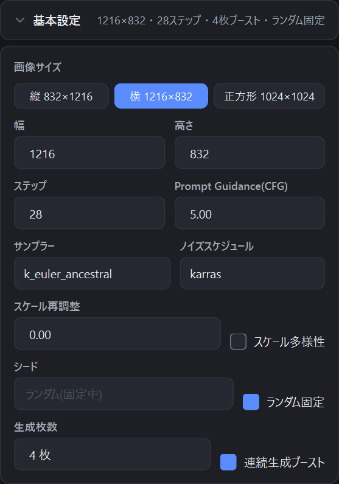

# 2. 画像を生成する

[目次に戻る](README.md)

## 基本の流れ

1. 画面上部でモデルを選びます(NovelAI Diffusion V5 / V4.5 / V4 / V3)。
2. 左上の「プロンプト」タブにプロンプトを、「ネガティブ」タブにネガティブプロンプトを入力します。
3. 「基本設定」で画像サイズなどを決めます。
4. 中央下の見積り(消費 Anlas)を確認し、「生成」を押します。

生成した画像は中央のプレビューに表示され、設定した保存先に自動で保存されます。
画像には NovelAI と同じ形式で生成設定が埋め込まれます。

## タグの入力補完

プロンプトの入力中に、タグの候補が表示されます。
V5 は文章でのプロンプトにも対応しているため、自動では候補を出しません。V5 で候補を出したいときは `Ctrl + Space` を押してください(ほかのモデルでも使えます)。

## 基本設定

| 項目 | 内容 |
|---|---|
| 画像サイズ | 「縦 832×1216」「横 1216×832」「正方形 1024×1024」から選ぶか、幅・高さを直接入力します(64 の倍数) |
| ステップ | 生成のステップ数 |
| Prompt Guidance(CFG) | プロンプトにどれだけ従うか |
| サンプラー / ノイズスケジュール | 生成方式 |
| スケール再調整 / スケール多様性 | NovelAI の同名の設定と同じです |
| シード | 空欄なら毎回ランダム。数字を入れると同じシードで生成します |
| ランダム固定 | オンの間はシードを空欄(毎回ランダム)に固定します。画像から設定を読み込んでも、シードは読み込みません |
| 生成枚数 | 1〜16 枚 |
| 連続生成ブースト | 下の説明を参照 |

### 連続生成ブースト

- **オフ**: 1 枚ずつ生成を繰り返します。Opus の無料枠の条件を満たせば、毎回無料になります。
- **オン**: NovelAI の同時生成(公式サイトと同じ)で、複数枚をまとめて生成します。速くなりますが、Opus の無料枠が効くのは 1 回のリクエストにつき 1 枚分だけです。
  1 回に同時生成できる枚数には画像サイズごとの上限(通常のサイズは 4 枚)があり、超える分は自動で分けて送ります。

## 消費 Anlas の見積り

中央下に、送信する前の消費 Anlas の見積りが表示されます。見積りは NovelAI 公式サイトと同じ計算方法に合わせていますが、目安であり、実際の消費量と異なる場合があります。

- **Opus の無料枠**: 画像サイズが 1024×1024 ピクセル以下(832×1216 など)で、ステップが 28 以下なら、1 枚分が無料になります。
- **Precise Reference**: 参照画像 1 枚につき、生成 1 枚あたり 5 Anlas が追加でかかります。
- **Opus の V5 生成の残量**: Opus で V5 を使うと、画面上部に残量と、満タンになるまでの目安時間が表示されます。

## 結果の一覧

今回生成した画像は、プレビューの下に小さく並びます。選んだ画像がプレビューに表示され、後処理の対象になります。

## 画像から設定を読み込む

NovelAI で生成した画像(このアプリや公式サイトで生成したもの)をウィンドウにドラッグ&ドロップすると、画像に埋め込まれた設定(プロンプト、サイズ、サンプラー、キャラクターなど)を読み込みます。
対応形式は PNG / JPG / WEBP / BMP です。「ランダム固定」がオンのときは、シードだけは読み込みません。

次は [キャラクターと配置](03-characters.md) です。
