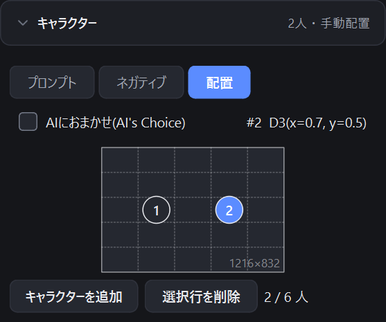
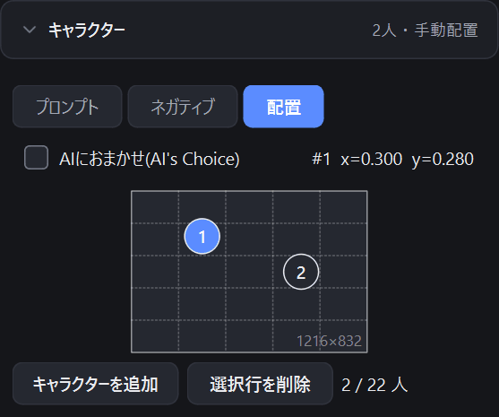

# 3. キャラクターと配置

[目次に戻る](README.md)

V4 以降のモデルでは、キャラクターごとにプロンプトを分けて指定できます(V3 では表示されません)。

## キャラクターを追加する

1. 左の「キャラクター」を開きます。
2. 「キャラクターを追加」を押し、「プロンプト」タブにそのキャラクターのプロンプトを入力します。
   キャラクターごとのネガティブプロンプトは「ネガティブ」タブに入力します。
3. 不要になったキャラクターは、行を選んで「選択行を削除」を押します。

キャラクターは V4 / V4.5 で 6 人まで、V5 で 22 人まで追加できます。

## 配置を決める

「配置」タブで、キャラクターを画像のどこに置くかを決めます。公式サイトと同じ操作です。

- **AIにおまかせ(AI's Choice)**: オンにすると、配置を AI が決めます。
- **手動で配置**: キャンバス上の番号(①②…)をドラッグして動かします。番号を動かすと「AIにおまかせ」は自動でオフになります。

| モデル | 配置の細かさ |
|---|---|
| V5 | 自由な位置に置けます |
| V4 / V4.5 | 5×5 のマス目のどこかに置きます(公式サイトと同じ) |

キャラクター同士が重なると品質が下がることがあり、重なっている番号は赤い枠で表示されます。配置を離すか、「AIにおまかせ」にしてください。

img2img / Infill で元画像を読み込んでいるときは、キャンバスの背景にその画像が薄く表示されます。

次は [参照画像と img2img / Infill](04-reference-img2img.md) です。
