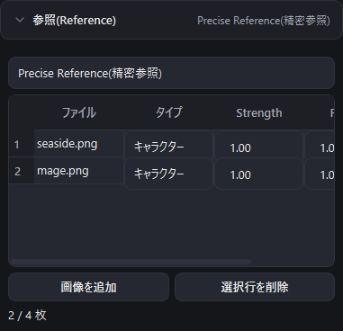
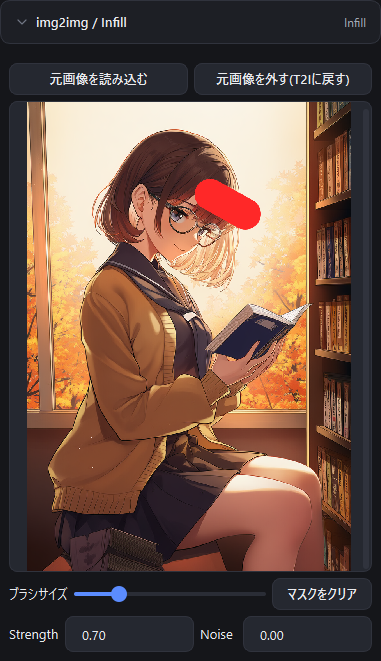

# 4. 参照画像と img2img / Infill

[目次に戻る](README.md)

## 参照(Reference)

左の「参照(Reference)」を開き、使う方式を選びます。選べる方式はモデルによって変わり、一度に使えるのは 1 つの方式だけです。

| 方式 | 使えるモデル | 内容 |
|---|---|---|
| Vibe Transfer(ポーション) | V3 / V4 / V4.5 | 参照画像の雰囲気を取り込みます。最大 16 枚。画像ごとに Strength と情報抽出度を設定します |
| Precise Reference(精密参照) | V4.5 | 参照画像のキャラクターや画風を取り込みます。最大 4 枚。画像ごとにタイプ(キャラクター / スタイル / キャラクター＆スタイル)、Strength、Fidelity を設定します |
| ControlNet(Control Tools) | V3 | 画像 1 枚から構図などを取り込みます |

「画像を追加」で参照画像を追加し、「選択行を削除」で外します。

> Precise Reference は、参照画像 1 枚につき生成 1 枚あたり 5 Anlas が追加でかかります(見積りに含まれます)。

## img2img / Infill

元画像をもとに生成し直す(img2img)、または一部分だけを描き直す(Infill)ための機能です。

1. 左の「img2img / Infill」を開き、「元画像を読み込む」を押して画像を選びます。
   画像サイズは元画像に合わせて自動で決まります(64 の倍数にそろえます)。
2. **img2img**: そのまま「生成」を押します。Strength(どれだけ変えるか)と Noise で変わり方を調整します。
3. **Infill**: 描き直したい部分をマウスでなぞって塗ります(赤く表示されます)。塗った部分だけが描き直されます。
   ブラシの太さは「ブラシサイズ」で、塗り直すときは「マスクをクリア」で消せます。

見出しの右には、今の状態(「未使用」「img2img」「Infill」)が表示されます。
普通の生成に戻すときは「元画像を外す(T2Iに戻す)」を押します。

次は [生成キューとバッチキュー](05-queue.md) です。
