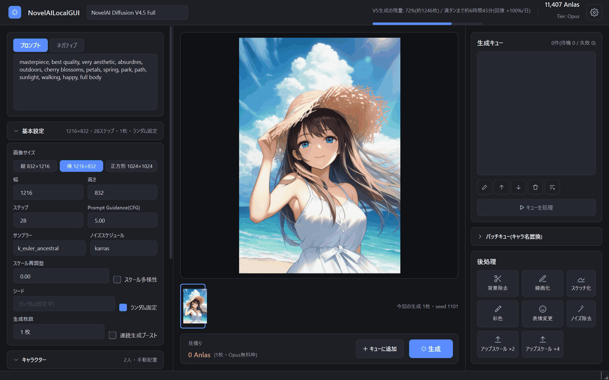
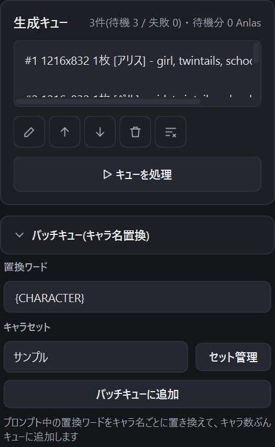

# 5. 生成キューとバッチキュー

[目次に戻る](README.md)

設定を変えながら生成したい画像をキューにためておき、まとめて順番に生成できます。

## キューに追加する

1. プロンプトや基本設定を入力します。
2. 中央下の「キューに追加」を押します(ショートカット: `Alt + Q`)。

キューには、追加した時点の設定がそのまま保存されます。追加した後に画面の設定を変えても、キューの中身は変わりません。

## キューを編集する

| 操作 | 内容 |
|---|---|
| 編集(鉛筆)/ ダブルクリック | プロンプト、ネガティブ、シード、生成枚数、連続生成ブーストを後から変更できます |
| 上へ / 下へ | 生成する順番を入れ替えます |
| 削除(ごみ箱) | 選んだアイテムを消します |
| 全てクリア | キューを空にします(処理中のアイテムは残ります) |

見出しの右には、件数と、待機中のアイテムの消費 Anlas の見積りの合計が表示されます。

## キューを処理する

「キューを処理」を押すと(ショートカット: `Ctrl + Shift + Q`)、上から順に生成します。

- 生成が終わったアイテムはキューから消えます。
- 処理中はボタンが「停止」に変わります。停止を押すと、今生成している 1 件が終わった時点で止まります。
- エラーになったアイテムは「✕」付きの赤い文字で表示され、キューに残ります(マウスを乗せるとエラーの内容が表示されます)。直してから、もう一度「キューを処理」を押すと再挑戦します。
- 1 件ずつ順番に送信し、エラーが起きたときは続けるかどうかを確認します。

## バッチキュー(キャラ名置換)

同じ設定で、キャラクター名だけを変えた画像をまとめてキューに追加する機能です。

1. 右の「バッチキュー(キャラ名置換)」を開きます。
2. 「置換ワード」を決めます(初期値は `{CHARACTER}`)。プロンプトの中の、キャラ名を入れたい場所にこの文字を書いておきます。
3. 「セット管理」で、キャラ名をまとめた「キャラセット」を作ります。
4. 使うキャラセットを選び、「バッチキューに追加」を押します。

例: プロンプトが `1girl, {CHARACTER}, smile` で、キャラセットが「アリス・ベル・クロエ」なら、`1girl, アリス, smile` のように置き換えた 3 件がキューに追加されます。

次は [後処理](06-postprocess.md) です。
