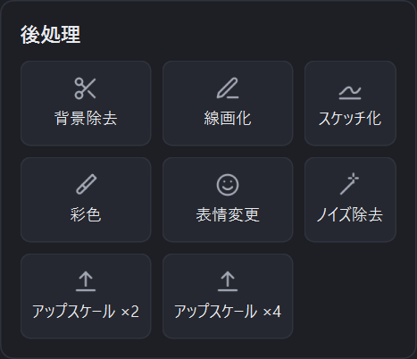

# 6. 後処理(Director Tools・アップスケール)

[目次に戻る](README.md)

生成した画像に、NovelAI の Director Tools やアップスケールをかけられます。

## 使い方

1. 後処理をかけたい画像をプレビューに表示します。
   - 今回生成した画像なら、プレビューの下の一覧から選びます。
   - 以前の画像なら、ウィンドウにドラッグ&ドロップします。
2. 右下の「後処理」から、使いたいボタンを押します。

結果はプレビューに表示され、保存先に自動で保存されます。続けて別の後処理をかけると、直前の結果に対してかかります。

## 後処理の種類

| ボタン | 内容 |
|---|---|
| 背景除去 | 背景を取り除きます |
| 線画化 | 線画にします |
| スケッチ化 | ラフスケッチ風にします |
| 彩色 | 線画やスケッチに色を塗ります。プロンプトで色を指定したり、「色補正」の強さを選んだりできます |
| 表情変更 | 表情を変えます。公式と同じ 24 種類の感情と、感情の強度から選びます(アニメ絵のみ対応。無表情に近い画像から始めるのがおすすめです) |
| ノイズ除去 | 画像の余計なノイズを取り除きます |
| アップスケール ×2 / ×4 | 画像を 2 倍 / 4 倍に拡大します |

後処理は、画像のサイズやプランによって Anlas を消費する場合があります。

次は [設定](07-settings.md) です。
