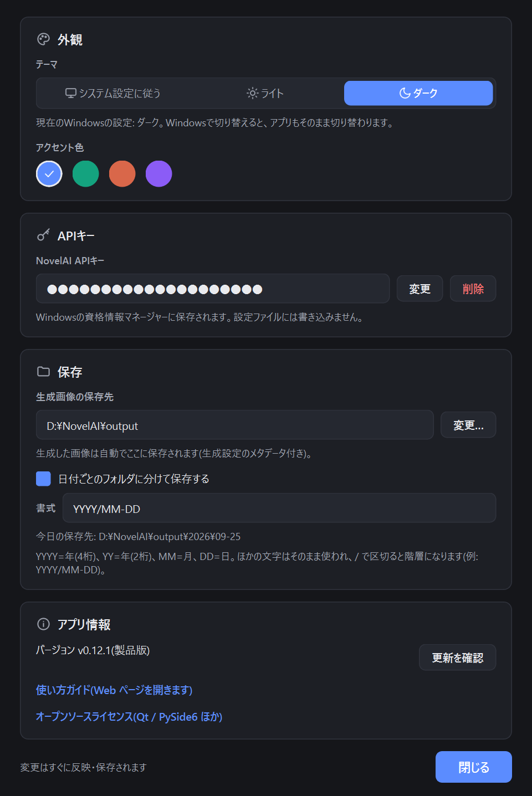

# 7. 設定

[目次に戻る](README.md)

画面右上の歯車を押すと、設定画面が開きます。変更はすぐに反映・保存されます。

## 外観

- **テーマ**: 「システム設定に従う」「ライト」「ダーク」から選びます。「システム設定に従う」では、Windows の設定を切り替えるとアプリも切り替わります。
- **アクセント色**: ボタンなどの色を 4 色から選びます。

## API キー

API キーの変更と削除ができます。削除すると、Windows の資格情報マネージャーから API キーが消えます。

## 保存

- **生成画像の保存先**: 「変更…」で保存するフォルダを選びます。初期値は「ピクチャ」フォルダの中の `NovelAILocalGUI` です。
- **日付ごとのフォルダに分けて保存する**: オンにすると、保存先の中に日付のフォルダを作って保存します。

### 日付フォルダの書式

| 記号 | 意味 | 例(2026年9月5日) |
|---|---|---|
| `YYYY` | 年(4桁) | 2026 |
| `YY` | 年(2桁) | 26 |
| `MM` | 月(2桁) | 09 |
| `DD` | 日(2桁) | 05 |

記号以外の文字はそのまま使われ、`/` で区切るとフォルダが階層になります。

| 書式 | 作られるフォルダ |
|---|---|
| `YYYYMMDD` | `20260905` |
| `YY-MM-DD` | `26-09-05` |
| `YYYY年MM月DD日` | `2026年09月05日` |
| `YYYY/MM-DD` | `2026` の中に `09-05` |

入力中に「今日の保存先」が表示されます。フォルダ名に使えない文字(`: * ? " < > |` など)を含む書式は赤字で理由が表示され、その間は直前の正しい書式で保存します。
日付は画像を保存した時点のものが使われます。

## アプリ情報

- バージョンと、製品版 / 体験版の区別が表示されます。
- **更新を確認**: 新しいバージョンがあるかを確認します(起動時にも自動で確認します)。
- **使い方ガイド**: このガイドをブラウザで開きます。
- **オープンソースライセンス**: 使用しているオープンソースソフトウェアと、そのライセンスを確認できます。

次は [体験版と製品版・アップデート](08-editions-update.md) です。
