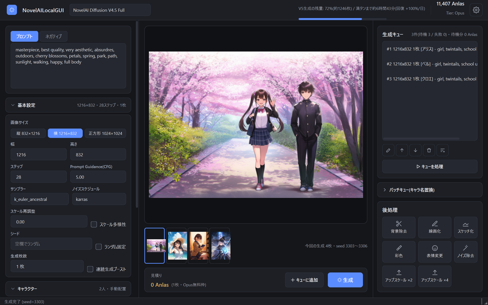

# NovelAILocalGUI 使い方ガイド

NovelAILocalGUI は、NovelAI の画像生成を Windows のデスクトップアプリで行うためのソフトです。
このガイドでは、インストールから各機能の使い方までを説明します。

## 目次

1. [はじめに(インストールと API キーの設定)](01-setup.md)
2. [画像を生成する](02-generate.md)
3. [キャラクターと配置](03-characters.md)
4. [参照画像と img2img / Infill](04-reference-img2img.md)
5. [生成キューとバッチキュー](05-queue.md)
6. [後処理(Director Tools・アップスケール)](06-postprocess.md)
7. [設定](07-settings.md)
8. [体験版と製品版・アップデート](08-editions-update.md)
9. [よくある質問・困ったとき](09-faq.md)

## 画面の構成

| 場所 | 内容 |
|---|---|
| 上部 | モデルの選択、Opus の V5 生成の残量、Anlas 残高とプラン(Tier)、設定(歯車) |
| 左 | プロンプト、基本設定、キャラクター、参照(Reference)、img2img / Infill |
| 中央 | プレビュー、今回の生成結果の一覧、消費 Anlas の見積り、「キューに追加」「生成」 |
| 右 | 生成キュー、バッチキュー、後処理 |

左側の「基本設定」「キャラクター」などは、見出しを押すと開いたり畳んだりできます。
畳んでいても、見出しの右側に中身の概要(例: `832×1216 ・ 28ステップ ・ 1枚`)が表示されます。

## リンク

- 販売ページ(製品版・体験版): https://zero0milk.booth.pm/items/8889836
- 利用規約: [EULA.md](../EULA.md)
- 不具合の報告: [Issues](../../../issues)(API キーは書き込まないでください)
